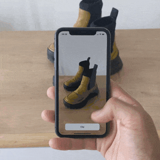
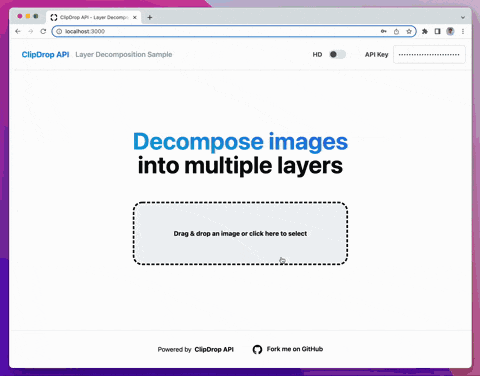

**ClipDrop API Samples**

A collection of open-source samples that demonstrate how to use the ClipDrop APIs on a broad range of applications and platforms.

 

# iOS Samples

## [ios/clip-demo](iOS/clip-demo)

A minimal SwiftUI app that shows how to remove the background of any object using the camera.

 
 

# Android Samples

## [android/ClipDropSample](android/ClipDropSample)

A minimal Kotlin app that shows how to remove the background of any object using the camera.

 
 

# Web Samples

## [web/decompose-layers](web/decompose-layers)

A sample React/Next.js/TailwindCSS app that decomposes images into separate layers.

Live app: https://clipdrop-api-sample-decompose-layers.vercel.app

## [web/remove-background-bulk](web/remove-background-bulk)

A sample React/Typescript app that allows processing images in bulk.

Live app: https://remove-background-bulk.vercel.app

