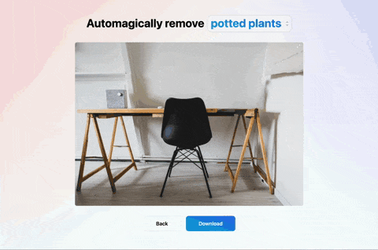

# Automatic Object Removal

A sample TensorflowJS/React/Next.js/TailwindCSS app that detects object bounding boxes using CocoSSD and ClipDrop API's inpainting endpoint to automatically remove the detected objects.



### Setup:

```
yarn dev
```

### Build:

```
yarn build
```
